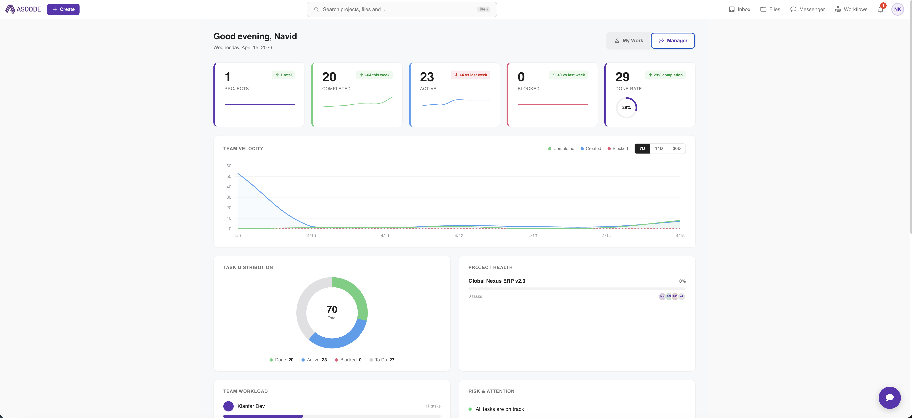
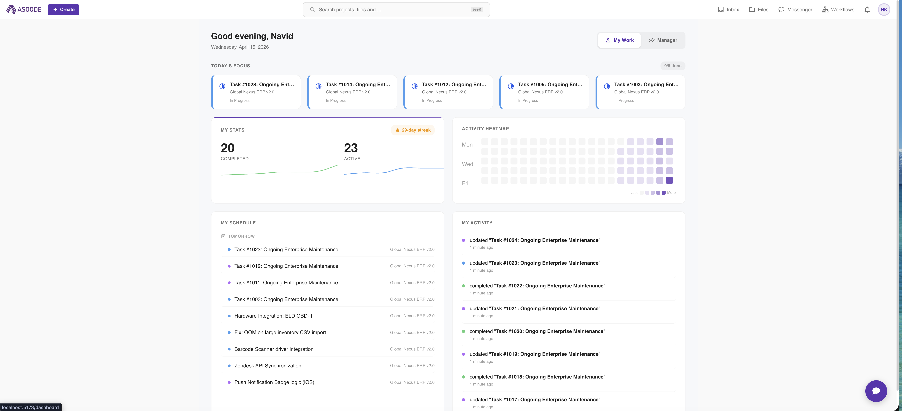
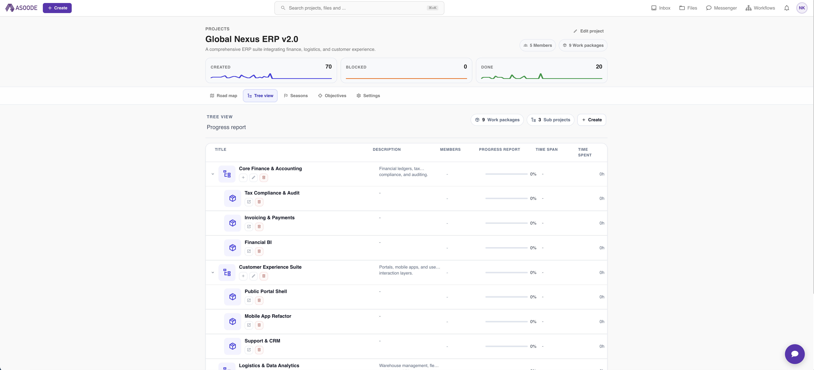
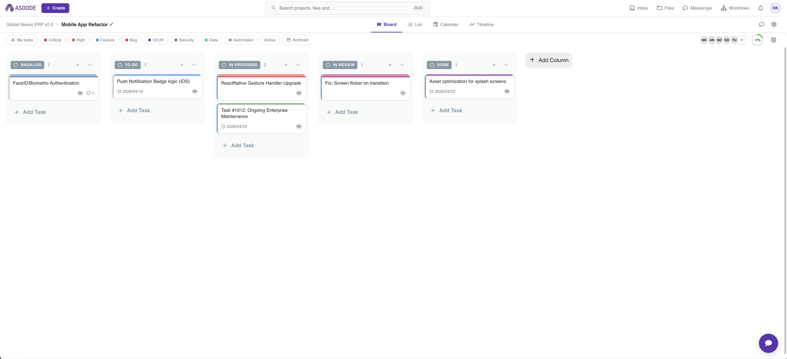
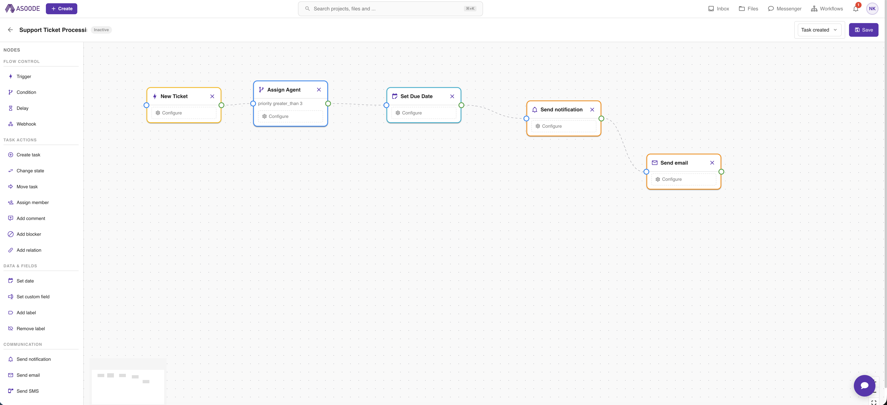
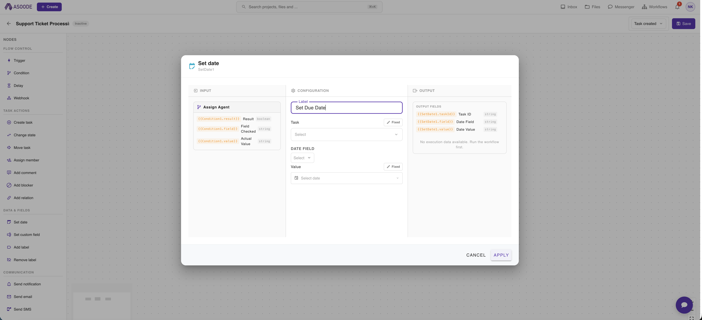
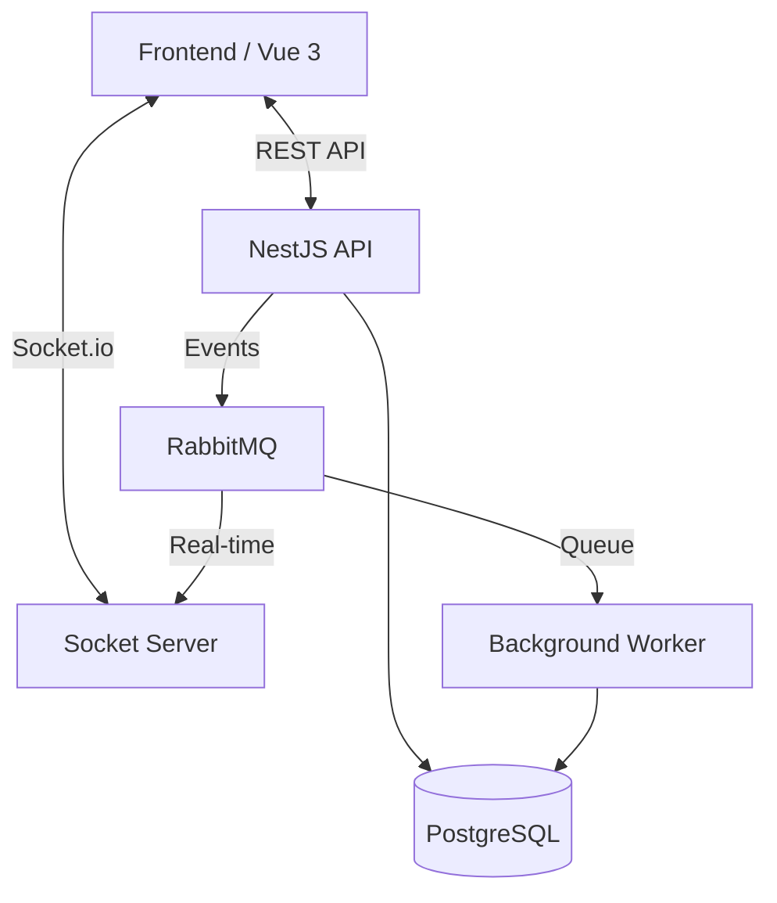

# 🚀 Asoode (آسوده)

A modern, high-performance, and real-time project management platform. Built for developers by developers, **Asoode** focuses on ease of use, speed, and enterprise-grade collaboration features.


---

## 🖼️ Visual Tour

### Dashboard & Personal Productivity
| Manager Insights | My Work Dashboard |
| :---: | :---: |
|  |  |

### Advanced Project Management
| Complex Project Tree | Kanban Board View |
| :---: | :---: |
|  |  |

### Automation & Workflows
| Workflow Designer | Node Editor |
| :---: | :---: |
|  |  |

---

## ✨ Key Features

- **Hierarchical Project Management**: Organize work with **Sub-Projects** and specialized **Work Packages** (Boards).
- **Advanced Task Tracking**: Kanban boards, detailed list views, and rich task metadata (Labels, Assignees, Due Dates).
- **Workflow Automation**: A powerful node-based designer to automate repetitive tasks:
    - **Triggers**: Manual or event-driven execution.
    - **Standard Actions**: Move tasks, change states, assign members, add comments.
    - **Notifications**: Instant Email, SMS, or In-app notifications.
    - **Logic**: Use expressions like `{{nodeId.field}}` for dynamic data flow between nodes.
- **Enterprise Collaboration**: 
    - **Messenger**: Built-in team chat with project-linked channels.
    - **Files**: Integrated file management (S3/Minio compatible) with versioning.
    - **RBAC**: Granular access control for groups, projects, and boards.
- **Global Reach**: 
    - **Multi-Calendar**: Seamless switching between Gregorian and Jalali (Persian) calendars.
    - **Real-time Engine**: Powered by Socket.io and RabbitMQ for millisecond latency on updates.
- **Modern UX**: PWA support, Dark/Light modes, and a high-density, focus-oriented interface.

---

## 🛠️ Tech Stack

### Monorepo Structure
- **Build System**: [Turbo](https://turbo.build/) & [pnpm](https://pnpm.io/)
- **Language**: TypeScript

### Backend (apps/backend, apps/socket, apps/worker)
- **Framework**: [NestJS](https://nestjs.com/)
- **ORM**: [Prisma](https://www.prisma.io/)
- **Database**: [PostgreSQL](https://www.postgresql.org/)
- **Messaging**: [RabbitMQ](https://www.rabbitmq.com/) (Event-driven architecture)
- **Storage**: [Minio](https://min.io/) (S3 Compatible)

### Frontend (apps/frontend, apps/website)
- **Framework**: [Vue 3](https://vuejs.org/) (Composition API)
- **UI Kit**: [Vuetify 3](https://vuetifyjs.com/)
- **State Management**: [Pinia](https://pinia.vuejs.org/)
- **Real-time**: [Socket.io Client](https://socket.io/)

---

## 🏗️ Architecture

Asoode utilizes an event-driven, micro-services inspired architecture to ensure scalability and real-time synchronization.



---

## 🚀 Getting Started

### Prerequisites
- Node.js >= 20
- pnpm >= 8
- Docker & Docker Compose

### Local Development

1. **Clone the repository**:
   ```bash
   git clone https://github.com/navid-kianfar/asoode.git
   cd asoode
   ```

2. **Install dependencies**:
   ```bash
   pnpm install
   ```

3. **Start Infrastructure**:
   ```bash
   docker-compose up -d
   ```

4. **Initialize Database**:
   ```bash
   cd apps/backend
   npx prisma migrate dev
   npx prisma db seed # Populates complex enterprise data
   ```

5. **Run in Development Mode**:
   ```bash
   pnpm dev
   ```

---

## 🤝 Contributing

We welcome contributions! Whether it's a bug fix, a new feature, or documentation improvements:
1. Fork the project.
2. Create your Feature Branch (`git checkout -b feature/AmazingFeature`).
3. Commit your changes (`git commit -m 'Add some AmazingFeature'`).
4. Push to the Branch (`git push origin feature/AmazingFeature`).
5. Open a Pull Request.

---

## 📄 License

Distributed under the MIT License. See `LICENSE` for more information.

---

Made with ❤️ by [Navid Kianfar](https://github.com/navid-kianfar)
