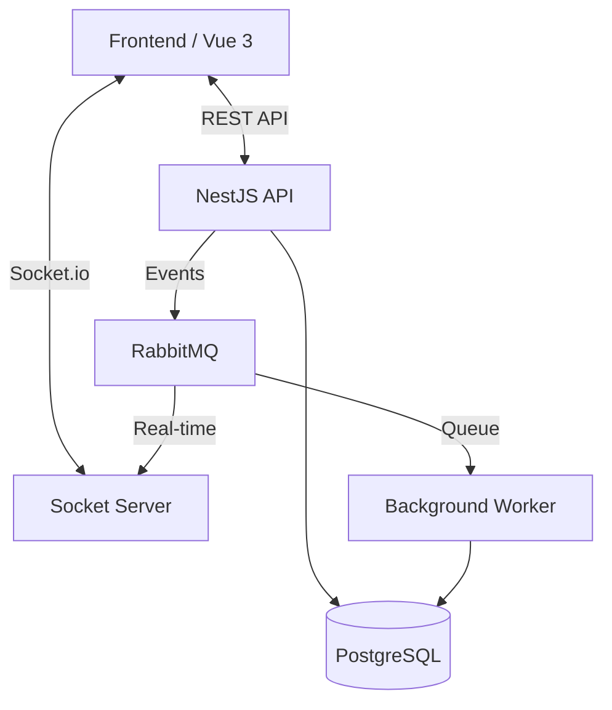

# 🚀 Asoode (آسوده)

A modern, high-performance, and real-time project management platform. Built for developers by developers, **Asoode** focuses on ease of use, speed, and real-time collaboration.


---

## ✨ Features

- **Work Package Management**: Advanced Kanban boards, list views, and task tracking.
- **Real-Time Collaboration**: Powered by Socket.io and RabbitMQ for instant updates across all clients.
- **Project Analytics**: Detailed charts and insights using Chart.js.
- **Messenger**: Built-in team chat with file sharing and real-time notifications.
- **File Management**: Integrated file storage and organization (Minio/S3 compatible).
- **Workflow Automation**: Design and execute automated task workflows.
- **Multi-Calendar Support**: Full support for Gregorian and Jalali (Persian) calendars.
- **PWA Ready**: Installable on mobile and desktop devices.

---

## 🛠️ Tech Stack

### Monorepo Structure
- **Build System**: [Turbo](https://turbo.build/) & [pnpm](https://pnpm.io/)
- **Language**: TypeScript

### Backend (apps/backend, apps/socket, apps/worker)
- **Framework**: [NestJS](https://nestjs.com/)
- **ORM**: [Prisma](https://www.prisma.io/)
- **Database**: [PostgreSQL](https://www.postgresql.org/)
- **Messaging**: [RabbitMQ](https://www.rabbitmq.com/)
- **Storage**: [Minio](https://min.io/) (S3 Compatible)

### Frontend (apps/frontend, apps/website)
- **Framework**: [Vue 3](https://vuejs.org/) (Composition API)
- **UI Kit**: [Vuetify 3](https://vuetifyjs.com/)
- **State Management**: [Pinia](https://pinia.vuejs.org/)
- **Real-time**: [Socket.io Client](https://socket.io/)
- **Architecture**: Clean, modular composables and stores.

---

## 🏗️ Architecture

Asoode uses a decoupled, event-driven architecture to ensure high availability and real-time responsiveness.



---

## 🚀 Getting Started

### Prerequisites
- Node.js >= 20
- pnpm >= 8
- Docker & Docker Compose

### Local Development

1. **Clone the repository**:
   ```bash
   git clone https://github.com/your-username/asoode.git
   cd asoode
   ```

2. **Install dependencies**:
   ```bash
   pnpm install
   ```

3. **Start Infrastructure (Postgres, RabbitMQ, Minio)**:
   ```bash
   docker-compose up -d
   ```

4. **Environment Variables**:
   Copy the `.env.example` in each app to `.env` and adjust as needed.

5. **Run in Development Mode**:
   ```bash
   pnpm dev
   ```

---

## 🐳 Docker Deployment

Asoode is fully containerized. Images for all services are built and pushed automatically via GitHub Actions.

### Using Docker Compose
Adjust the `docker-compose.yml` to use the pre-built images:
```yaml
services:
  backend:
    image: your-username/asoode-backend:latest
  frontend:
    image: your-username/asoode-frontend:latest
  # ... other services
```

---

## 🤝 Contributing

We welcome contributions! Please follow these steps:
1. Fork the project.
2. Create your Feature Branch (`git checkout -b feature/AmazingFeature`).
3. Commit your changes (`git commit -m 'Add some AmazingFeature'`).
4. Push to the Branch (`git push origin feature/AmazingFeature`).
5. Open a Pull Request.

---

## 📄 License

Distributed under the MIT License. See `LICENSE` for more information.

---

Made with ❤️ by [Navid Kianfar](https://github.com/navid-kianfar)
